# 模式识别与机器学习 Project - [AI Cures](https://www.aicures.mit.edu/)

杜逸闲

宁晨然

## 问题描述

给出若干种化合物的SMILES表示，要求判断其是否对Covid-19具有抗性，输出为0或者1，是一个2分类问题。

### 化合物的SMILES表示

SMILES (implified molecular input line entry specification), 是一种用ASCII字符串描述分子结构的规范，语法如下：

1. 原子用方括号内的化学元素表示，可以省略，如`[Au]`表示金原子。在有机物中只有C、N、O、P、S、Br、Cl、I可以省略方括号。
2. 氢原子忽略不写，当化合价不足时用氢原子补足。如水的SMILES是`O`。
3. 原子间双键用'='表示，三键用'#'表示。
4. 如果结构中有环，将环断开并在断开的两个原子旁用同一个数字标记，表示原子间有键相连。
5. 芳香环中的C、O、S、N原子分别用小写字母c, o, s, n表示。
6. 分支结构用圆括号表示。

SMILES的局限性在于没法很好的表示分子的空间排列。

下面是一些实例：
1. 水：O 
   
   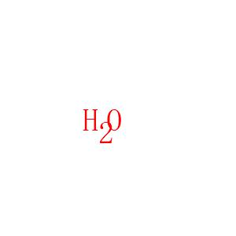
2. 乙醇：CCO 
   
   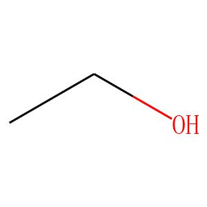
3. 二氧化碳：O=C=O 
   
   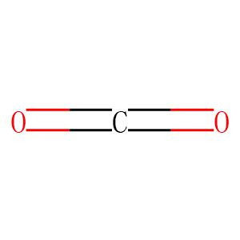
4. 氰化氢：C#N 
   
   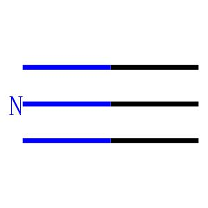
5. 环已烷：C1CCCCC1 
   
   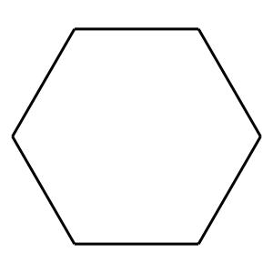
6. 乙烷：CC 
   
   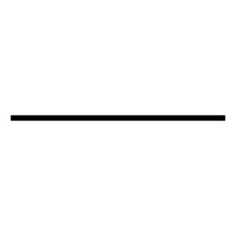
7. 乙烯：C=C 
   
   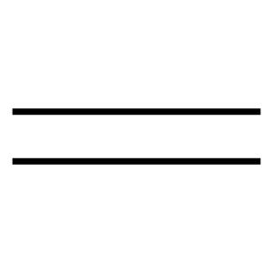
8. 乙炔：C#C
   
   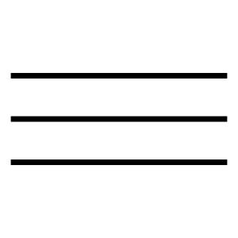
9. 乙酸乙酯：CC(=O)OCC 
    
   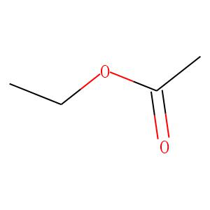

### 数据集获取

在[官方论坛](https://www.aicures.mit.edu/forum/_data)填写自己的姓名和邮箱可以获取到数据本次Benchmark的数据，也可以在[数据页面](https://www.aicures.mit.edu/data)下载其他数据集。

## 评价标准

了解数据评价标准可以帮助我们更好的评价自己的模型。该任务的评价标准有四个，见[Task页面](https://www.aicures.mit.edu/tasks)下的排名. 

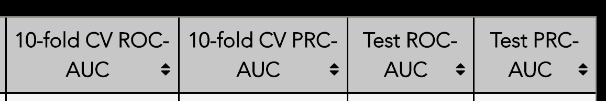

### 交叉验证

由于该数据集的规模较小，为了防止过拟合，数据集将被平分为10份。每次训练我们选取其中的9份作为训练集，剩下的1份作为验证集。上图的10-fold CV (cross validation)前缀就代表交叉验证。

### ROC-AUC && PRC-AUC

对于交叉验证和总测试集，我们都有两个指标，ROC-AUC和PRC-AUC, 他们均能一定程度上反应分类器的性能，但在本项目中PRC-AUC会用作分类器排序的第一参数。我们将分别介绍ROC-AUC和PRC-AUC并分析为何PRC-AUC在此项目中更为重要。

在一个二分类任务中，对于一个分类器的预测结果，我们有如下的定义：

1. $TP$, True Positive为真正例（测试集标记为正，分类器预测为正）的数量。
2. $FP$, False Positive为假正例（测试集标记为负，而分类器预测为正）的数量。
3. $FN$, False Negative为假负例（测试集标记为正，分类器预测为负）的数量。
4. $TN$, True Negative为真负例（测试集标记为负，分类器预测为负）的数量。

#### ROC曲线

在了解ROC (Receiver Operating Characteristic) 曲线之前，我们定义两个指标：

1. 真正例率 (True Positive Rate, TPR), 表示所有正例中，预测为正例的比例： 
   $$TPR = \frac{TP}{TP + FN}$$
2. 假正例率 (False, Positive Rate, FPR), 表示所有负例中，预测为正例的比例：
   $$FPR = \frac{FP}{TN + FP}$$

在一个二分任务里，很多分类器输出一个实数值或者一个概率，接着设定一个阈值，当高于这个阈值时标记为正例，反之标记为负例。

因此，当改变这个阈值的时候，$TPR$和$FPR$也会相应的改变。我们以$FPR$为横坐标，$TPR$为纵坐标，当阈值改变时就可以得到一系列的点（很显然这些点关于阈值的函数是“连续”的），我们将这些点连接起来平滑处理就可以得到ROC曲线了。下图中蓝色实现即为某分类器的ROC曲线，而红色虚线为随机情况下的ROC曲线。

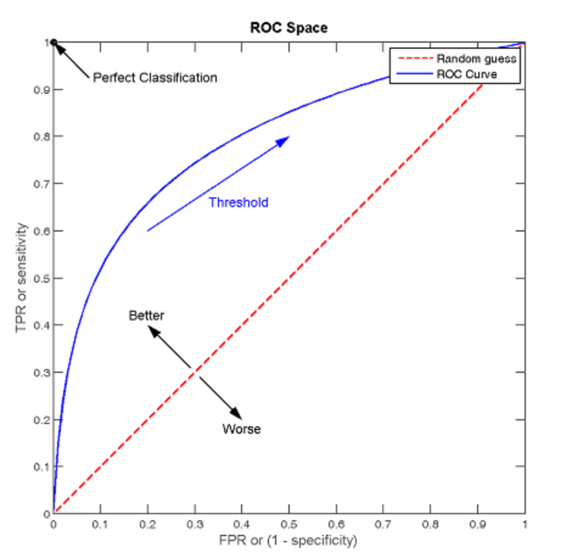

#### ROC-AUC

$AUC$ (Area Under Curve) 就是曲线下的面积。该值的实际上代表了一个概率：随机选择一个正例和一个负例，该分类器对于正例的输出比负例高的概率（之前说过分类器输出一个实数值）。那么ROC-AUC越大，代表分类器越有对于正例输出较大的值，即能够更好的分类。

用以下标准可以大概通过AUC预估分类器的性能:

1. $AUC = 1$, 该分类器是完美的，因为其ROC曲线是一条经过(0, 1)的折线，一定存在一个分类器输出的阈值使得，$TPR = 1, FPR = 0$, 即正确率为100%. 
2. $0.5 < AUC < 1$, 该分类器有一定价值，选取合适阈值的话可以得到优于随即猜测的结果。
3. $AUC = 0.5$, 该分类器效果基本等于随机，随机分类的ROC曲线为一条直线。
4. $AUC < 0.5$, 该分类器劣于随机，需要优化或者找出错误时，但将输出结果取反可以得到由于随机的结果。

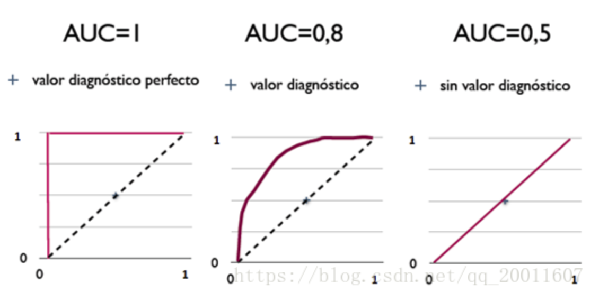

#### PR曲线

在了解PRC (Precision-Recall Curve)之前，我们同样定义两个指标：

1. 查准率 (Precision), 表示所有分类器预测的正例中，真正的正例的比例：
   $$Precision = \frac{TP}{TP + FP}$$
2. 查全率 (Recall), 表示所有正例中，预测为正例的比例：
   $$Recall = \frac{TP}{TP + FN}$$

与ROC曲线类似，以$Recall$作为横坐标, $Precision$作为纵坐标，改变阈值后得到的点连线后得到一条曲线（折线）。下图就是一个PR曲线的例子：


同样PRC-AUC也是指PRC曲线下方的面积，取值范围在[0, 1]之间，越大越好。

#### PRC-AUC的优势

PR和ROC在面对一个正负样本不均衡的数据集时的表现是不同的。在数据不平衡时，PR曲线是很敏感的，随着正负样本比例的变化，PR曲线会发生强烈的变化；而ROC曲线是不敏感的，其曲线基本不变。

因此ROC面对不平衡数据的一直表现表明其可以衡量一个模型本身的预测能力，而这个预测能力与样本正负比例无关。而PR曲线因为对样本比较敏感，因此在样本比例发生变化时，可以看出分类器对应的效果。

在实际数据中，样本比例经常是不平衡的，即正例远多于负例或者反之。因此PR曲线更有助于了解分类器实际的效果和作用，以此来改进模型。

而在本数据集下，正负样本数量相差悬殊，负例远远多于正例。在总训练集`train.csv`中，正例只有48个，而我们总共有2097个例子！在这种情况下，哪怕是一个非常差劲的模型，ROC的效果看上去依然不错，但是PR上效果则一般。这说明当正负样本比例悬殊较大时，PR曲线比ROC曲线更能反映分类器的性能。

因此在本项目中采用PRC-AUC作为第一评测指标。

## 工具

### RDKit

RDKit是一个强大的开源化学信息python工具包，其和机器学习的联系紧密，可以方便的将分子模型转化成图神经网络所需的格式，同时可以生成用于机器学习的分子描述符。由于其核心数据结构和算法均由C++实现，效率比较令人满意。

RDKit可以很方便的将分子的SMILES串转化成分子模型并以多种格式输出，如下代码可以读入SMILES串并保存为图片格式：

```python
SMILES = "C1CCCCC1"
Mol = Chem.MolFromSmiles(SMILES)
Draw.MolToImageFile(Mol, "环已烷.jpg")
```

### DGL

DGL是一款开源的专门面向图神经网络的框架

## 结果

### MPNN

使用MPNN模型进行训练，当batch大小设置为64, epoch大小设置为20。虽然epoch较小，但对于所有10个分数据集，训练集ROC-AUC都在接近20个epoch时达到0.82左右，但对测试集进行10折交叉验证后ROC-AUC在0.6到0.8范围内波动。

为了继续分析该模型的性能，将其中一个小数据集拿出来以后，将epoch设置到200。由于我们电脑性能的不足，训练了将近两小时才得出结果。epoch增大时，训练集ROC-AUC基本稳步增大，当120之后基本收敛到0.97左右，这说明该分类器在训练集上的表现已经相当好。可是对测试集进行交叉验证以后发现ROC-AUC一直在0.65到0.85范围内波动，且方差较大。推测原因可能有如下几点：
1. 模型在训练过程中过拟合。
2. 由于测试集太小，再对其进行十折交叉验证得到的实际测试集就过于小，因此波动较大。
3. 测试集和训练集内负例都远远多于正例，导致ROC-AUC值不能很好的反映模型的分类能力。